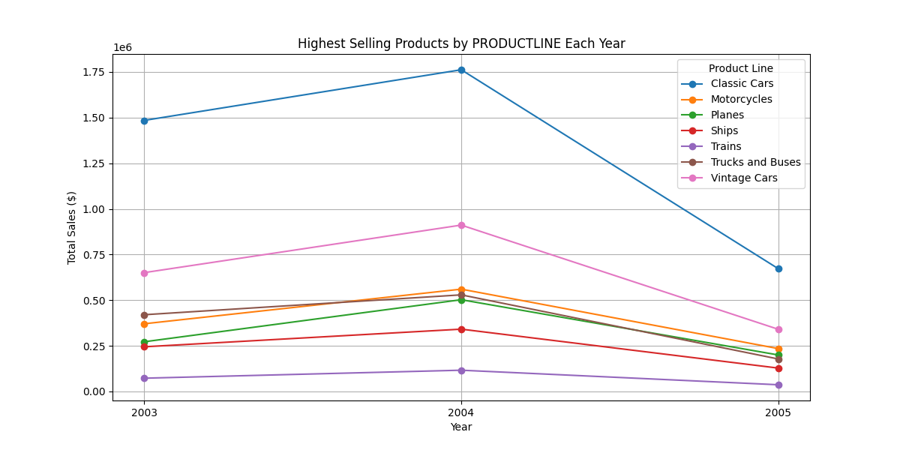

# Business Summary Report on Sales Analysis of Product Lines

## Executive Summary
This report encapsulates an analysis of sales data for various product lines over the years 2003 to 2005. It highlights trends, provides actionable insights, and outlines strategic recommendations based on the findings.

## 1. Key Takeaways from the Analysis

### Total Sales by Product Line:

- **2003**:
  - **Classic Cars**: $1,484,785.29
  - **Motorcycles**: $370,895.58
  - **Planes**: $272,257.60
  - **Ships**: $244,821.09
  - **Trains**: $72,802.29
  - **Trucks and Buses**: $420,429.93
  - **Vintage Cars**: $650,987.76

- **2004**:
  - **Classic Cars**: $1,762,257.09
  - **Motorcycles**: $560,545.23
  - **Planes**: $502,671.80
  - **Ships**: $341,437.97
  - **Trains**: $116,523.85
  - **Trucks and Buses**: $529,302.89
  - **Vintage Cars**: $911,423.77

- **2005**:
  - **Classic Cars**: $672,573.28
  - **Motorcycles**: $234,947.53
  - **Planes**: $200,074.17
  - **Ships**: $128,178.07
  - **Trains**: $36,917.33
  - **Trucks and Buses**: $178,057.02
  - **Vintage Cars**: $340,739.31

## 2. Visual Representation
The following plot illustrates the total sales per product line for each year, showcasing the performance trends across different categories.

## 3. Implications for Business Strategy
The data indicates that **Classic Cars** consistently generated the highest sales across the analyzed years, peaking in 2004. **Motorcycles** and **Vintage Cars** also showed strong performance, while **Trains** and **Ships** had lower sales figures, suggesting potential areas for improvement.

### Strategic Implications:
- **Focus on High Performers**: Given the strong sales of Classic Cars, businesses should enhance marketing strategies around this product line.
- **Address Underperformers**: Investigate the reasons for the low sales of Trains to determine if product adjustments or marketing strategies are necessary.

## 4. Recommendations
- **Enhance Marketing Campaigns**: Allocate more resources towards promoting high-performing product lines, particularly Classic Cars and Motorcycles, to capitalize on their market strength.
  
- **Product Development and Diversification**: Consider introducing new models or variations within the successful product lines to attract a broader customer base.

- **Monitor Sales Trends**: Implement regular reviews of sales data to quickly identify shifts in consumer preferences and adjust strategies accordingly.

## 5. Next Steps
- Conduct a deeper analysis of customer demographics and purchasing behaviors for the highest-performing products to tailor marketing efforts more effectively.
- Explore potential partnerships or promotions that could boost sales in lower-performing product lines, particularly Trains and Ships.
- Set quarterly reviews to assess sales performance and adapt strategies in real-time based on market feedback and sales data.

This structured analysis provides a comprehensive understanding of sales dynamics across different product lines, aiding in strategic decision-making for future growth and market positioning.